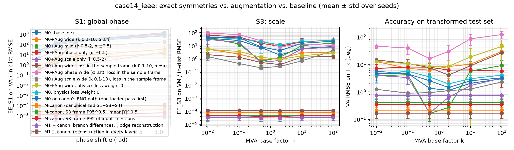

# AC-PF symmetry audit — trained on case14_ieee

Seeds per model: { M0 (baseline): 5, M0+Aug wide (k 0.1-10, α ±π): 3, M0+Aug mild (k 0.5-2, α ±0.5): 3, M0+Aug phase only (α ±0.5): 3, M0+Aug scale only (k 0.5-2): 3, M0+Aug wide, loss in the sample frame (k 0.1-10, α ±π): 3, M0+Aug phase wide (α ±π), loss in the sample frame: 3, M0+Aug scale wide (k 0.1-10), loss in the sample frame: 3, M0+Aug wide, physics loss weight 0: 3, M0, physics loss weight 0: 3, M0 on canon's RNG path (one loader pass first): 3, M-canon (canonicalized S1+S3+S4): 5, M-canon, S3 frame P95^0.5 · mean|Y|^0.5: 3, M-canon, S3 frame P95 of input injections: 3, M1 + canon: branch differences, Hodge reconstruction: 5, M1 + canon, reconstruction in every layer: 4 }

### In-distribution test RMSE

| model | VM (p.u.) | VA (deg) | PG (MW) | QG (Mvar) | PBE (MVA) | epochs |
|---|---|---|---|---|---|---|
| M0 (baseline) | 0.00271 ± 0.0013 | 0.29 ± 0.093 | 2.15 ± 0.36 | 10.4 ± 5.4 | 0.175 ± 0.021 | 150 ± 0 |
| M0+Aug wide (k 0.1-10, α ±π) | 0.0444 ± 0.024 | 6 ± 5.5 | 109 ± 85 | 127 ± 86 | 25.7 ± 4.6 | 76.7 ± 50 |
| M0+Aug mild (k 0.5-2, α ±0.5) | 0.00124 ± 0.00038 | 0.164 ± 0.07 | 1.71 ± 0.59 | 3.67 ± 0.69 | 0.159 ± 0.045 | 150 ± 0 |
| M0+Aug phase only (α ±0.5) | 0.00108 ± 0.00025 | 0.115 ± 0.024 | 0.935 ± 0.14 | 3.14 ± 0.86 | 0.118 ± 0.0074 | 150 ± 0 |
| M0+Aug scale only (k 0.5-2) | 0.00173 ± 0.0002 | 0.227 ± 0.036 | 2.27 ± 0.47 | 6.25 ± 0.93 | 0.187 ± 0.031 | 150 ± 0 |
| M0+Aug wide, loss in the sample frame (k 0.1-10, α ±π) | 0.102 ± 0.018 | 5.74 ± 1.4 | 59.7 ± 32 | 189 ± 26 | 38.5 ± 5.9 | 64 ± 16 |
| M0+Aug phase wide (α ±π), loss in the sample frame | 0.00394 ± 0.0017 | 0.472 ± 0.13 | 6.85 ± 2.1 | 11.3 ± 6.4 | 1.17 ± 0.74 | 150 ± 0 |
| M0+Aug scale wide (k 0.1-10), loss in the sample frame | 0.00351 ± 0.00074 | 1 ± 0.075 | 13.8 ± 1.4 | 10.9 ± 2.7 | 0.774 ± 0.081 | 150 ± 0 |
| M0+Aug wide, physics loss weight 0 | 0.046 ± 0.011 | 4.97 ± 0.95 | 58.2 ± 28 | 123 ± 86 | 106 ± 19 | 77.7 ± 44 |
| M0, physics loss weight 0 | 0.0015 ± 2.1e-05 | 0.182 ± 0.037 | 2.58 ± 0.67 | 2.28 ± 0.74 | 1.11 ± 0.2 | 150 ± 0 |
| M0 on canon's RNG path (one loader pass first) | 0.00143 ± 0.00021 | 0.177 ± 0.026 | 1.81 ± 0.31 | 5.09 ± 0.77 | 0.145 ± 0.014 | 150 ± 0 |
| M-canon (canonicalized S1+S3+S4) | 0.00163 ± 0.00051 | 0.216 ± 0.064 | 2.11 ± 0.46 | 5.93 ± 2.4 | 0.163 ± 0.024 | 150 ± 0 |
| M-canon, S3 frame P95^0.5 · mean|Y|^0.5 | 0.0035 ± 0.0016 | 0.422 ± 0.14 | 3.56 ± 0.76 | 13.1 ± 7 | 0.241 ± 0.033 | 150 ± 0 |
| M-canon, S3 frame P95 of input injections | 0.00312 ± 0.00089 | 0.356 ± 0.067 | 2.67 ± 0.57 | 11.9 ± 3.7 | 0.195 ± 0.02 | 150 ± 0 |
| M1 + canon: branch differences, Hodge reconstruction | 0.00384 ± 0.0015 | 0.734 ± 0.19 | 6.94 ± 1.5 | 14 ± 6.3 | 0.505 ± 0.091 | 150 ± 0 |
| M1 + canon, reconstruction in every layer | 0.00103 ± 0.00015 | 0.168 ± 0.06 | 1.94 ± 0.73 | 2.64 ± 0.41 | 0.161 ± 0.027 | 150 ± 0 |

### In-distribution angle error split (R7): VA² = offset² + rest²

| model | VA (deg) | VA common offset (deg) | VA minus offset (deg) | θ_f − θ_t (deg) |
|---|---|---|---|---|
| M0 (baseline) | 0.29 ± 0.093 | 0.284 ± 0.094 | 0.0554 ± 0.011 | 0.0804 ± 0.027 |
| M0+Aug wide (k 0.1-10, α ±π) | 6 ± 5.5 | 4.95 ± 5.3 | 3.08 ± 2 | 2.58 ± 1.5 |
| M0+Aug mild (k 0.5-2, α ±0.5) | 0.164 ± 0.07 | 0.159 ± 0.068 | 0.042 ± 0.016 | 0.045 ± 0.017 |
| M0+Aug phase only (α ±0.5) | 0.115 ± 0.024 | 0.112 ± 0.024 | 0.025 ± 0.0041 | 0.0313 ± 0.0062 |
| M0+Aug scale only (k 0.5-2) | 0.227 ± 0.036 | 0.22 ± 0.033 | 0.0576 ± 0.013 | 0.0627 ± 0.0082 |
| M0+Aug wide, loss in the sample frame (k 0.1-10, α ±π) | 5.74 ± 1.4 | 4.3 ± 2.2 | 3.36 ± 0.42 | 3.05 ± 0.29 |
| M0+Aug phase wide (α ±π), loss in the sample frame | 0.472 ± 0.13 | 0.438 ± 0.11 | 0.173 ± 0.066 | 0.159 ± 0.059 |
| M0+Aug scale wide (k 0.1-10), loss in the sample frame | 1 ± 0.075 | 0.953 ± 0.072 | 0.301 ± 0.021 | 0.269 ± 0.022 |
| M0+Aug wide, physics loss weight 0 | 4.97 ± 0.95 | 2.66 ± 1.1 | 4.05 ± 0.96 | 5.32 ± 1.9 |
| M0, physics loss weight 0 | 0.182 ± 0.037 | 0.164 ± 0.037 | 0.0777 ± 0.014 | 0.0723 ± 0.0099 |
| M0 on canon's RNG path (one loader pass first) | 0.177 ± 0.026 | 0.171 ± 0.025 | 0.0462 ± 0.0086 | 0.0494 ± 0.0075 |
| M-canon (canonicalized S1+S3+S4) | 0.216 ± 0.064 | 0.209 ± 0.063 | 0.0538 ± 0.013 | 0.0588 ± 0.016 |
| M-canon, S3 frame P95^0.5 · mean|Y|^0.5 | 0.422 ± 0.14 | 0.412 ± 0.14 | 0.0922 ± 0.017 | 0.114 ± 0.038 |
| M-canon, S3 frame P95 of input injections | 0.356 ± 0.067 | 0.348 ± 0.067 | 0.0718 ± 0.017 | 0.0967 ± 0.017 |
| M1 + canon: branch differences, Hodge reconstruction | 0.734 ± 0.19 | 0.704 ± 0.19 | 0.207 ± 0.047 | 0.193 ± 0.049 |
| M1 + canon, reconstruction in every layer | 0.168 ± 0.06 | 0.159 ± 0.056 | 0.0539 ± 0.019 | 0.0468 ± 0.014 |

### Equivariance error EE_g / in-distribution RMSE, same channel (> 1: symmetry breaking dominates)

| model | phase 3.14159 (VA) | phase 0.1 (VA) | scale 10 (VM) | scale 100 (VM) | scale 0.01 (VM) | flip 0.5 (VA) | fliptrafo 1 (VM) |
|---|---|---|---|---|---|---|---|
| M0 (baseline) | 663 ± 2.1e+02 | 15.2 ± 5.2 | 6.26 ± 3.1 | 8.65 ± 4.4 | 38 ± 30 | 2.37e-05 ± 1.2e-05 | 0.0516 ± 0.038 |
| M0+Aug wide (k 0.1-10, α ±π) | 32.4 ± 27 | 0.795 ± 0.65 | 2.76 ± 1.3 | 3.41 ± 2 | 5.41 ± 3 | 6.52e-06 ± 6.8e-06 | 0.0064 ± 0.0042 |
| M0+Aug mild (k 0.5-2, α ±0.5) | 1.15e+03 ± 4.5e+02 | 0.316 ± 0.023 | 10.2 ± 3.8 | 16.1 ± 7.3 | 39.3 ± 13 | 7.15e-05 ± 2.8e-05 | 0.0148 ± 0.0031 |
| M0+Aug phase only (α ±0.5) | 1.41e+03 ± 4e+02 | 0.269 ± 0.12 | 20.2 ± 15 | 26.3 ± 20 | 65 ± 38 | 8.44e-05 ± 1.9e-05 | 0.0653 ± 0.034 |
| M0+Aug scale only (k 0.5-2) | 768 ± 1.1e+02 | 16.9 ± 4.4 | 5.69 ± 0.91 | 7.97 ± 0.69 | 30.3 ± 17 | 3.95e-05 ± 1.6e-05 | 0.129 ± 0.11 |
| M0+Aug wide, loss in the sample frame (k 0.1-10, α ±π) | 13.5 ± 4.8 | 0.393 ± 0.18 | 1.34 ± 0.31 | 1.56 ± 0.43 | 2.07 ± 1 | 7.57e-06 ± 4.3e-06 | 0.00458 ± 0.0045 |
| M0+Aug phase wide (α ±π), loss in the sample frame | 17.6 ± 10 | 0.221 ± 0.0052 | 13.4 ± 9.5 | 10.6 ± 6.9 | 94.8 ± 28 | 7.51e-05 ± 3.6e-05 | 0.0142 ± 0.0066 |
| M0+Aug scale wide (k 0.1-10), loss in the sample frame | 174 ± 14 | 4.59 ± 0.29 | 0.7 ± 0.2 | 4.15 ± 0.87 | 1.49 ± 0.7 | 3.68e-06 ± 8.7e-07 | 0.00227 ± 0.0013 |
| M0+Aug wide, physics loss weight 0 | 14.8 ± 9.4 | 0.953 ± 0.19 | 1.7 ± 0.56 | 2.83 ± 1.5 | 5.23 ± 2.7 | 5.31e-05 ± 5.2e-05 | 0.0477 ± 0.027 |
| M0, physics loss weight 0 | 982 ± 2.1e+02 | 26.6 ± 5.3 | 21.5 ± 8.2 | 24.7 ± 9.8 | 46.1 ± 29 | 4.95e-05 ± 1.9e-05 | 0.0368 ± 0.026 |
| M0 on canon's RNG path (one loader pass first) | 1e+03 ± 1.8e+02 | 23.1 ± 4.9 | 15.5 ± 11 | 22.1 ± 12 | 42.5 ± 11 | 4.35e-05 ± 7.6e-06 | 0.0482 ± 0.014 |
| M-canon (canonicalized S1+S3+S4) | 3.85e-05 ± 1.3e-05 | 2.62e-05 ± 1.1e-05 | 8.3e-05 ± 2.4e-05 | 8.21e-05 ± 2.5e-05 | 8.3e-05 ± 2.5e-05 | 4.1e-05 ± 1.4e-05 | 8.05e-05 ± 2.4e-05 |
| M-canon, S3 frame P95^0.5 · mean|Y|^0.5 | 1.91e-05 ± 6.3e-06 | 1.21e-05 ± 3.8e-06 | 4.7e-05 ± 2.9e-05 | 4.75e-05 ± 3e-05 | 4.61e-05 ± 2.9e-05 | 1.68e-05 ± 7.3e-06 | 4.49e-05 ± 2.9e-05 |
| M-canon, S3 frame P95 of input injections | 1.93e-05 ± 4.1e-06 | 1.27e-05 ± 4e-06 | 4.5e-05 ± 1.7e-05 | 4.46e-05 ± 1.6e-05 | 4.44e-05 ± 1.7e-05 | 1.55e-05 ± 5.3e-06 | 4.17e-05 ± 1.4e-05 |
| M1 + canon: branch differences, Hodge reconstruction | 9e-06 ± 3.9e-06 | 5.12e-06 ± 2.3e-06 | 3.25e-05 ± 1.3e-05 | 3.24e-05 ± 1.3e-05 | 3.29e-05 ± 1.3e-05 | 9.07e-06 ± 5.5e-06 | 3.17e-05 ± 1.4e-05 |
| M1 + canon, reconstruction in every layer | 9.53e-05 ± 6.5e-05 | 8.63e-05 ± 6.4e-05 | 0.000111 ± 1.9e-05 | 0.000114 ± 1.7e-05 | 0.000114 ± 1.9e-05 | 0.000108 ± 6.4e-05 | 0.000111 ± 1.9e-05 |

### Zero-shot test RMSE on case30_ieee (never seen in training; normalizer: source)

| model | VM (p.u.) | VA (deg) | PG (MW) | QG (Mvar) | PBE (MVA) | epochs |
|---|---|---|---|---|---|---|
| M0 (baseline) | 0.0163 ± 0.0068 | 1.81 ± 1 | 29.6 ± 21 | 25.6 ± 12 | 6.6 ± 2 | 150 ± 0 |
| M0+Aug wide (k 0.1-10, α ±π) | 0.0682 ± 0.014 | 27.3 ± 24 | 342 ± 2.7e+02 | 115 ± 69 | 74.3 ± 59 | 76.7 ± 50 |
| M0+Aug mild (k 0.5-2, α ±0.5) | 0.0112 ± 0.0017 | 7.44 ± 3.2 | 133 ± 49 | 16.6 ± 7 | 7.39 ± 1.6 | 150 ± 0 |
| M0+Aug phase only (α ±0.5) | 0.0279 ± 0.0067 | 6.27 ± 1.1 | 157 ± 30 | 29.1 ± 9.6 | 11.3 ± 1.5 | 150 ± 0 |
| M0+Aug scale only (k 0.5-2) | 0.0135 ± 0.0029 | 1.86 ± 0.8 | 57.2 ± 39 | 14.4 ± 6.7 | 4.78 ± 2.4 | 150 ± 0 |
| M0+Aug wide, loss in the sample frame (k 0.1-10, α ±π) | 0.158 ± 0.031 | 29.7 ± 19 | 272 ± 2.2e+02 | 248 ± 21 | 123 ± 58 | 64 ± 16 |
| M0+Aug phase wide (α ±π), loss in the sample frame | 0.14 ± 0.036 | 32.4 ± 12 | 375 ± 2.4e+02 | 222 ± 37 | 76.1 ± 8.4 | 150 ± 0 |
| M0+Aug scale wide (k 0.1-10), loss in the sample frame | 0.0132 ± 0.0014 | 1.81 ± 0.1 | 48.7 ± 3.3 | 19.5 ± 3.7 | 4.13 ± 0.35 | 150 ± 0 |
| M0+Aug wide, physics loss weight 0 | 0.0955 ± 0.014 | 26.1 ± 17 | 172 ± 85 | 196 ± 81 | 196 ± 1e+02 | 77.7 ± 44 |
| M0, physics loss weight 0 | 0.0252 ± 0.0047 | 2.34 ± 1 | 49 ± 29 | 18.5 ± 5.8 | 19.2 ± 7.9 | 150 ± 0 |
| M0 on canon's RNG path (one loader pass first) | 0.0179 ± 0.006 | 1.1 ± 0.19 | 10.5 ± 1 | 9.03 ± 3.6 | 5.09 ± 1 | 150 ± 0 |
| M-canon (canonicalized S1+S3+S4) | 0.0164 ± 0.0025 | 1.69 ± 0.67 | 43.6 ± 36 | 23.3 ± 16 | 6.99 ± 2.4 | 150 ± 0 |
| M-canon, S3 frame P95^0.5 · mean|Y|^0.5 | 0.0165 ± 0.0095 | 3.52 ± 0.79 | 67 ± 33 | 17.1 ± 4.4 | 9.5 ± 1.6 | 150 ± 0 |
| M-canon, S3 frame P95 of input injections | 0.0237 ± 0.0022 | 5.26 ± 1.7 | 105 ± 36 | 23.7 ± 16 | 9.52 ± 1.9 | 150 ± 0 |
| M1 + canon: branch differences, Hodge reconstruction | 0.0146 ± 0.0028 | 2.16 ± 0.61 | 26.8 ± 11 | 27.1 ± 10 | 46.5 ± 24 | 150 ± 0 |
| M1 + canon, reconstruction in every layer | 0.0108 ± 0.001 | 1.9 ± 0.98 | 17.7 ± 13 | 11 ± 6.2 | 4.7 ± 0.74 | 150 ± 0 |

### Zero-shot test RMSE on case57_ieee (never seen in training; normalizer: source)

| model | VM (p.u.) | VA (deg) | PG (MW) | QG (Mvar) | PBE (MVA) | epochs |
|---|---|---|---|---|---|---|
| M0 (baseline) | 0.0329 ± 0.013 | 7.71 ± 0.72 | 217 ± 30 | 68.7 ± 29 | 11.4 ± 1.2 | 150 ± 0 |
| M0+Aug wide (k 0.1-10, α ±π) | 0.0762 ± 0.0046 | 26.6 ± 27 | 732 ± 6.6e+02 | 245 ± 1.3e+02 | 91.1 ± 59 | 76.7 ± 50 |
| M0+Aug mild (k 0.5-2, α ±0.5) | 0.0261 ± 0.0056 | 6.39 ± 3.4 | 138 ± 89 | 99.2 ± 2 | 12.6 ± 2.2 | 150 ± 0 |
| M0+Aug phase only (α ±0.5) | 0.0259 ± 0.0067 | 10.4 ± 6.7 | 394 ± 2.6e+02 | 77.6 ± 34 | 14.3 ± 3.2 | 150 ± 0 |
| M0+Aug scale only (k 0.5-2) | 0.0257 ± 0.0061 | 9.37 ± 1.5 | 322 ± 63 | 39.2 ± 14 | 10.1 ± 1.2 | 150 ± 0 |
| M0+Aug wide, loss in the sample frame (k 0.1-10, α ±π) | 0.164 ± 0.017 | 30.6 ± 9.2 | 666 ± 5.6e+02 | 337 ± 31 | 129 ± 67 | 64 ± 16 |
| M0+Aug phase wide (α ±π), loss in the sample frame | 0.118 ± 0.033 | 36 ± 13 | 1.08e+03 ± 5.1e+02 | 280 ± 23 | 98.8 ± 5.7 | 150 ± 0 |
| M0+Aug scale wide (k 0.1-10), loss in the sample frame | 0.0363 ± 4.8e-05 | 9.94 ± 0.26 | 341 ± 28 | 71.5 ± 15 | 11.5 ± 0.25 | 150 ± 0 |
| M0+Aug wide, physics loss weight 0 | 0.121 ± 0.03 | 36.4 ± 20 | 857 ± 4.4e+02 | 422 ± 1.5e+02 | 307 ± 1.5e+02 | 77.7 ± 44 |
| M0, physics loss weight 0 | 0.0392 ± 0.0098 | 11.1 ± 1.7 | 400 ± 44 | 102 ± 29 | 30.9 ± 13 | 150 ± 0 |
| M0 on canon's RNG path (one loader pass first) | 0.0211 ± 0.0016 | 8.23 ± 0.78 | 250 ± 34 | 69.1 ± 31 | 9.71 ± 0.48 | 150 ± 0 |
| M-canon (canonicalized S1+S3+S4) | 0.025 ± 0.01 | 9.73 ± 1.1 | 340 ± 74 | 79.9 ± 17 | 11.6 ± 1.9 | 150 ± 0 |
| M-canon, S3 frame P95^0.5 · mean|Y|^0.5 | 0.0238 ± 0.0049 | 9.3 ± 1.4 | 255 ± 74 | 140 ± 25 | 14.1 ± 1.8 | 150 ± 0 |
| M-canon, S3 frame P95 of input injections | 0.0198 ± 0.0016 | 9.44 ± 0.86 | 281 ± 35 | 121 ± 20 | 12.3 ± 1.1 | 150 ± 0 |
| M1 + canon: branch differences, Hodge reconstruction | 0.0263 ± 0.0057 | 8.38 ± 1.4 | 317 ± 1.2e+02 | 83.4 ± 19 | 40.4 ± 13 | 150 ± 0 |
| M1 + canon, reconstruction in every layer | 0.0266 ± 0.006 | 7.25 ± 2.4 | 219 ± 75 | 101 ± 15 | 10.8 ± 1.1 | 150 ± 0 |

