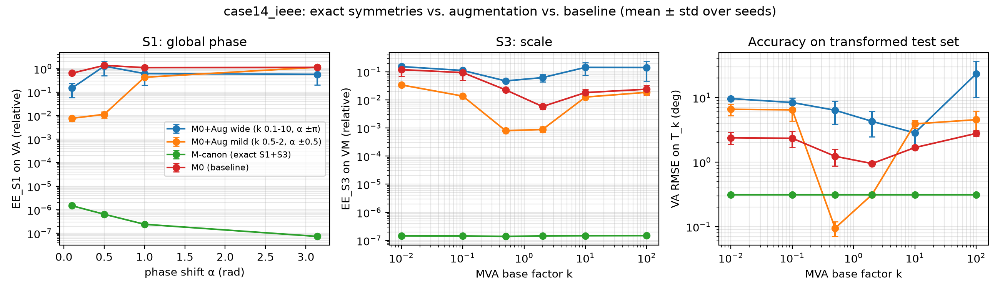

# AC-PF symmetry audit — trained on case14_ieee

Seeds per model: { M0+Aug wide (k 0.1-10, α ±π): 2, M0+Aug mild (k 0.5-2, α ±0.5): 2, M-canon (exact S1+S3): 1, M0 (baseline): 2 }

### In-distribution test RMSE

| model | VM (p.u.) | VA (deg) | PG (MW) | QG (Mvar) | PBE (MVA) | epochs |
|---|---|---|---|---|---|---|
| M0+Aug wide (k 0.1-10, α ±π) | 0.0701 ± 0.0045 | 6.74 ± 2 | 101 ± 34 | 180 ± 21 | 22.9 ± 1.6 | 95.5 ± 54 |
| M0+Aug mild (k 0.5-2, α ±0.5) | 0.000835 ± 6.2e-05 | 0.118 ± 0.023 | 1.69 ± 0.4 | 0.875 ± 0.065 | 0.197 ± 0.008 | 150 ± 0 |
| M-canon (exact S1+S3) | 0.00247 | 0.312 | 2.75 | 9.8 | 0.176 | 150 |
| M0 (baseline) | 0.0046 ± 0.00019 | 0.677 ± 0.093 | 5.78 ± 1.7 | 18.5 ± 0.81 | 0.317 ± 0.08 | 150 ± 0 |

### Equivariance error EE_g (relative, on predicted entries)

| model | phase 3.14159 (VA) | phase 0.1 (VA) | scale 10 (VM) | scale 100 (VM) | scale 0.01 (VM) | flip 0.5 (VA) |
|---|---|---|---|---|---|---|
| M0+Aug wide (k 0.1-10, α ±π) | 0.569 ± 0.36 | 0.148 ± 0.09 | 0.143 ± 0.069 | 0.141 ± 0.094 | 0.152 ± 0.031 | 1.65e-06 ± 1.2e-06 |
| M0+Aug mild (k 0.5-2, α ±0.5) | 1.14 ± 0.0097 | 0.00771 ± 0.0017 | 0.0125 ± 0.00052 | 0.0185 ± 0.00037 | 0.0339 ± 0.00059 | 1.09e-06 ± 1.7e-07 |
| M-canon (exact S1+S3) | 7.36e-08 | 1.48e-06 | 1.47e-07 | 1.48e-07 | 1.45e-07 | 9.05e-07 |
| M0 (baseline) | 1.12 ± 0.022 | 0.638 ± 0.043 | 0.0181 ± 0.0052 | 0.0239 ± 0.0091 | 0.119 ± 0.05 | 7.62e-07 ± 1.7e-07 |

### Zero-shot test RMSE on case30_ieee (never seen in training)

| model | VM (p.u.) | VA (deg) | PG (MW) | QG (Mvar) | PBE (MVA) | epochs |
|---|---|---|---|---|---|---|
| M0+Aug wide (k 0.1-10, α ±π) | 0.163 ± 0.013 | 13.8 ± 5 | 192 ± 1.4e+02 | 289 ± 44 | 62.2 ± 25 | 95.5 ± 54 |
| M0+Aug mild (k 0.5-2, α ±0.5) | 0.02 ± 0.0065 | 12.6 ± 1.1 | 164 ± 7.2 | 43.1 ± 26 | 9.29 ± 2.9 | 150 ± 0 |
| M-canon (exact S1+S3) | 0.0121 | 2.18 | 47 | 13.4 | 6.51 | 150 |
| M0 (baseline) | 0.0637 ± 0.014 | 2.05 ± 0.54 | 19.7 ± 8 | 52 ± 0.15 | 12.5 ± 0.9 | 150 ± 0 |

### Zero-shot test RMSE on case57_ieee (never seen in training)

| model | VM (p.u.) | VA (deg) | PG (MW) | QG (Mvar) | PBE (MVA) | epochs |
|---|---|---|---|---|---|---|
| M0+Aug wide (k 0.1-10, α ±π) | 0.0869 ± 0.017 | 22.3 ± 4.3 | 730 ± 2.3e+02 | 205 ± 46 | 102 ± 56 | 95.5 ± 54 |
| M0+Aug mild (k 0.5-2, α ±0.5) | 0.0283 ± 0.0038 | 6.32 ± 0.83 | 198 ± 80 | 181 ± 31 | 17.8 ± 0.31 | 150 ± 0 |
| M-canon (exact S1+S3) | 0.017 | 7.08 | 232 | 139 | 10.1 | 150 |
| M0 (baseline) | 0.0259 ± 0.00062 | 8.35 ± 1.5 | 247 ± 79 | 79.9 ± 23 | 13.1 ± 0.23 | 150 ± 0 |

