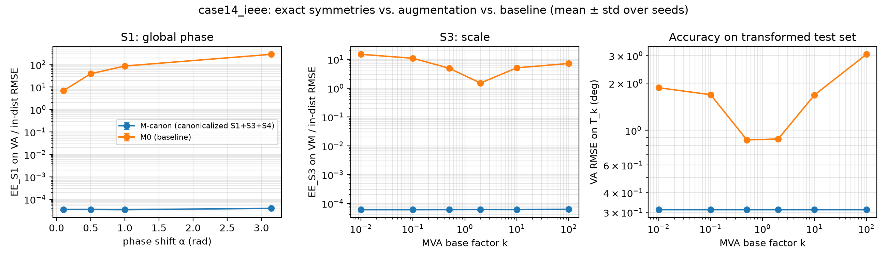

# AC-PF symmetry audit — trained on case14_ieee

Seeds per model: { M-canon (canonicalized S1+S3+S4): 1, M0 (baseline): 1 }

### In-distribution test RMSE

| model | VM (p.u.) | VA (deg) | PG (MW) | QG (Mvar) | PBE (MVA) | epochs |
|---|---|---|---|---|---|---|
| M-canon (canonicalized S1+S3+S4) | 0.00247 | 0.312 | 2.75 | 9.8 | 0.176 | 150 |
| M0 (baseline) | 0.00478 | 0.584 | 4.11 | 19.3 | 0.237 | 150 |

### Equivariance error EE_g / in-distribution RMSE, same channel (> 1: symmetry breaking dominates)

| model | phase 3.14159 (VA) | phase 0.1 (VA) | scale 10 (VM) | scale 100 (VM) | scale 0.01 (VM) | flip 0.5 (VA) | fliptrafo 1 (VM) |
|---|---|---|---|---|---|---|---|
| M-canon (canonicalized S1+S3+S4) | 3.91e-05 | 3.46e-05 | 6.07e-05 | 6.23e-05 | 6.04e-05 | 3.55e-05 | 5.94e-05 |
| M0 (baseline) | 287 | 6.88 | 5.07 | 7.17 | 14.9 | 1.94e-05 | 0.0211 |

### Zero-shot test RMSE on case30_ieee (never seen in training; normalizer: source)

| model | VM (p.u.) | VA (deg) | PG (MW) | QG (Mvar) | PBE (MVA) | epochs |
|---|---|---|---|---|---|---|
| M-canon (canonicalized S1+S3+S4) | 0.0121 | 2.18 | 47 | 13.4 | 6.51 | 150 |
| M0 (baseline) | 0.0232 | 1.84 | 41.3 | 26.8 | 8.16 | 150 |

### Zero-shot test RMSE on case57_ieee (never seen in training; normalizer: source)

| model | VM (p.u.) | VA (deg) | PG (MW) | QG (Mvar) | PBE (MVA) | epochs |
|---|---|---|---|---|---|---|
| M-canon (canonicalized S1+S3+S4) | 0.017 | 7.08 | 232 | 139 | 10.1 | 150 |
| M0 (baseline) | 0.0322 | 9.7 | 301 | 68.6 | 17.6 | 150 |

